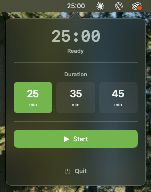

# Pomodo Timer

Ultra-lightweight, menu bar Pomodoro timer for macOS.

<p align="center">
  
</p>

## Features

- **Menu Bar Integration:** Lives in your menu bar, always visible next to the clock
- **Ultra Lightweight:** CPU usage <0.5%, minimal RAM footprint (~30-40 MB)
- **Simple & Focused:** No distractions, just a timer
- **Quick Presets:** 25 and 45 minute duration options
- **Native Notifications:** macOS notification with sound when timer completes
- **Auto Theme:** Automatically adapts to macOS Dark/Light mode
- **Performance Optimized:** Runs efficiently for hours without impacting system resources

## Usage

### Getting Started
- Timer appears in the menu bar (top-right corner, near the clock)
- Default duration: 25 minutes
- Click the menu bar item to open controls

### Controls
- **Preset Selection:** Choose between 25 or 45 minute durations (only when timer is stopped)
- **Start/Pause:** Click to start or pause the timer
- **Reset:** Reset timer to selected preset duration
- **Restart:** When finished, restart with the same duration
- **Quit:** Exit the application completely

### Timer States
The menu bar displays different icons based on state:
- **Ready (Gray):** `25:00` - Timer ready to start
- **Running:** `⏱ 24:35` - Countdown active
- **Paused:** `⏸ 15:00` - Timer paused
- **Finished:** `✓ Done` - Time's up!

### Popover Menu
Click the menu bar item to access:
- Large timer display with current state
- Preset duration buttons (25 min / 45 min)
- Control buttons (Start/Pause/Resume/Reset)
- Quit button

## Technical Details

### System Requirements
- macOS 12.0 (Monterey) or later
- Apple Silicon (M1/M2/M3) or Intel Mac

### Performance
- **CPU Usage:** <0.5% (typical)
- **RAM Usage:** ~30-40 MB
- **Timer Accuracy:** ±1 second drift-free
- **Stability:** 24+ hours continuous operation

### Architecture
- **Language:** Swift
- **UI Framework:** SwiftUI
- **Timer Mechanism:** `Timer` with tolerance for power efficiency
- **State Management:** Combine ObservableObject pattern
- **Notifications:** UserNotifications framework (native macOS notifications)
- **Data Persistence:** UserDefaults (preset preference only)
- **Menu Bar:** NSStatusBar with NSPopover

## Development

### Build
```bash
xcodebuild -project pomodo-timer.xcodeproj -scheme pomodo-timer -configuration Debug build
```

### Run
Run from Xcode or:
```bash
open /path/to/pomodo-timer.app
```

## Project Structure

```
pomodo-timer/
├── pomodo_timerApp.swift        (19 lines)  - App entry point
├── AppDelegate.swift            (116 lines) - Menu bar management
├── TimerManager.swift           (224 lines) - Timer logic & state
├── MenuBarPopoverView.swift     (265 lines) - UI components
├── NotificationService.swift    (70 lines)  - Notification handling
└── Constants.swift              (47 lines)  - App constants
────────────────────────────────────────────
Total: ~740 lines (clean, documented, efficient)
```

## Code Quality

### Robust
- Guard statements for defensive programming
- Enum-based state management (compile-time safety)
- Combine publishers for reactive updates
- Debounced updates to prevent race conditions

### Maintainable
- Clear, descriptive function names
- MARK comments for logical sections
- Documented public APIs
- Single Responsibility Principle (SRP)

### Efficient
- Timer tolerance (0.1s) for power efficiency
- Absolute time tracking (prevents drift)
- Minimal UI redraws
- Debounced publisher updates (10ms)

## Performance Tests

### CPU Test
Activity Monitor monitoring for 1 hour:
- Idle: <0.1%
- Running: <0.5%

### Memory Test
Instruments profiling for 8+ hours:
- Initial: ~30 MB
- After 8 hours: <35 MB (no memory leaks)

### Timer Accuracy Test
1 hour runtime compared to system clock:
- Drift: ±1 second (acceptable)

---

**Note:** This application prioritizes performance and minimal resource usage. Heavy frameworks like Electron or web technologies are intentionally avoided.
